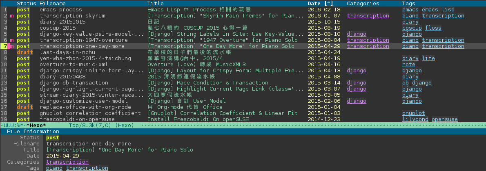
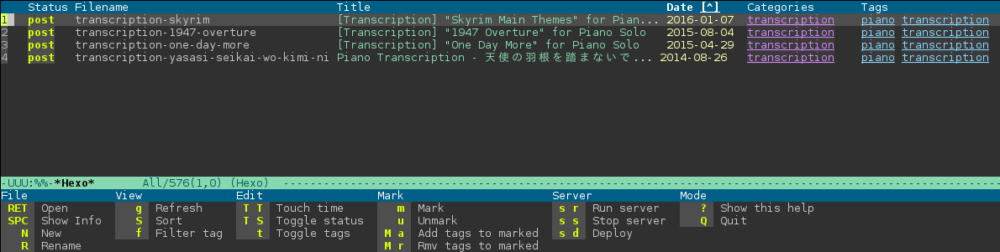

# hexo-mode

This repository includes my tweaks to the excellent
[hexo](https://github.com/kuanyui/hexo.el), an emacs mode for working with
[Hexo](http://hexo.io/) blogs. 

The project was forked on 3/25/16.

## Changes 

The following are the changes I've made so far to the original.

Other changes:

* changed repo name from hexo.el to hexo-mode (mainly to differentiate from the
  original work)
  
* changing where 'date' comes from.  Originally it was from the `date:` field in
the front matter.  In this version it is pulled from the 'last modified' date of
the file.

* fixed an apparent bug:  keymap was looking for `hexo-command-help` while
  function was names `hexo-command-quick-help`.  I changed the keymap.


## Rest of This README

The following us unchanged from the original.

## Original

Emacs major-mode & tools for [Hexo](https://github.com/hexojs/hexo).

### Screenshots




### Requirement
- hexo
- Emacs >= 24.3

### Install

*hexo.el* is available on [MELPA](https://github.com/melpa/melpa) now.

```
(add-to-list 'load-path "~/path/to/hexo.el/dir")
(require 'hexo)
```

You can define your function to open a specified hexo repository directly like this:

```
(defun hexo-my-blog ()
    (interactive)
    (hexo "~/my-blog/"))
```

### Usage
`M-x hexo` to use `hexo-mode`.

#### Common Commands

The following commands are available in =markdown-mode=, =dired-mode=, =hexo-mode= 

| Command                           | Description                                                                |
|-----------------------------------|----------------------------------------------------------------------------|
| *hexo-new*                        | Create new post anywhere.                                                  |
| *hexo-move-article*               | Move article between *_post/* and *_draft/*.                               |
| *hexo-touch-files-in-dir-by-time* | Touch all files by their timestamp to make files sortable in file-manager. |
| *hexo-server-run*                 | Open Hexo server process (posts only / posts + drafts)                     |
| *hexo-server-stop*                | Stop Hexo server process                                                   |
| *hexo-server-deploy*              | Deploy                                                                     |

#### Commands for Markdown

The following commands are only available in *markdown-mode*

| Command                            | Description                                                                        |
|------------------------------------|--------------------------------------------|
| *hexo-insert-article-link*         | Insert a link to specific article in *_posts/*.  
| *hexo-update-current-article-date* | Update article's date stamp by current time. **This may change its permanent link!** |
| *hexo-follow-post-link*            | Open the article file link under the cursor   |

#### Commands for *hexo-mode*

The following commands & key-bindings are available in *hexo-mode*.

```
Prefix *hexo-command-* means the function is only available under *hexo-mode*
```

| Command                              | Key         | Description                                                                  |
|--------------------------------------|-------------|----------------------------|
| **File**                                 |    |     |
| *hexo-command-open-file*             | *RET*       | Open file                                                                    |
| *hexo-command-show-article-info*     | *SPC*       | Show article info                                                            |
| *hexo-new*                           | *n*         | Create file                                                                  |
| *hexo-command-rename-file*           | *R*, *[f2]* | Rename file                                                                  |
| **View**                                 |    |     |
| *hexo-command-revert-tabulated-list* | *g*         | Refresh                                                                      |
| *tabulated-list-sort*                | *S*         | Sort according to this column header                                         |
| *hexo-command-filter-tag*            | *f*         | Filter article by tag                                                        |
| **Edit**                                 |             |                                                                              |
| *hexo-touch-files-in-dir-by-time*    | *T T*       | *touch* all files by their timestamp to make files sortable in file-manager. |
| *hexo-toggle-article-status*         | *T S*       | Toggle article status (Move file between *_posts/* and *_drafts/*)           |
| *hexo-command-tags-toggler*          | *t*         | Add / Remove tags of a *single* article                                      |
| **Mark**                                 |             |                                                                              |
| *hexo-command-mark*                  | *m*         | Mark article                                                                 |
| *hexo-command-unmark*                | *u*         | Unmark article                                                               |
| *hexo-command-add-tags*              | *M a*       | Add tags to all marked articles                                              |
| *hexo-command-remove-tags*           | *M r*       | Remove tags from all marked articles                                         |
| **Server**                               |             |                                                                              |
| *hexo-server-run*                    | *s r*       | Open Hexo server process (posts only / posts + drafts)                       |
| *hexo-server-stop*                   | *s s*       | Stop Hexo server process                                                     |
| *hexo-server-deploy*                 | *s d*       | Deploy                                                                       |
| **Mode**         |   |    | 
| *hexo-command-quick-help*           | *h*, *?*    | Show key-binding cheat sheet                                                 |
| *kill-buffer-and-window*             | *Q*         | Quit                                                                         |


### License
MIT

Copyright (c) 2014-2016 ono hiroko (kuanyui)

Permission is hereby granted, free of charge, to any person obtaining
a copy of this software and associated documentation files (the
"Software"), to deal in the Software without restriction, including
without limitation the rights to use, copy, modify, merge, publish,
distribute, sublicense, and/or sell copies of the Software, and to
permit persons to whom the Software is furnished to do so, subject to
the following conditions:

The above copyright notice and this permission notice shall be
included in all copies or substantial portions of the Software.

THE SOFTWARE IS PROVIDED "AS IS", WITHOUT WARRANTY OF ANY KIND,
EXPRESS OR IMPLIED, INCLUDING BUT NOT LIMITED TO THE WARRANTIES OF
MERCHANTABILITY, FITNESS FOR A PARTICULAR PURPOSE AND
NONINFRINGEMENT. IN NO EVENT SHALL THE AUTHORS OR COPYRIGHT HOLDERS BE
LIABLE FOR ANY CLAIM, DAMAGES OR OTHER LIABILITY, WHETHER IN AN ACTION
OF CONTRACT, TORT OR OTHERWISE, ARISING FROM, OUT OF OR IN CONNECTION
WITH THE SOFTWARE OR THE USE OR OTHER DEALINGS IN THE SOFTWARE.
